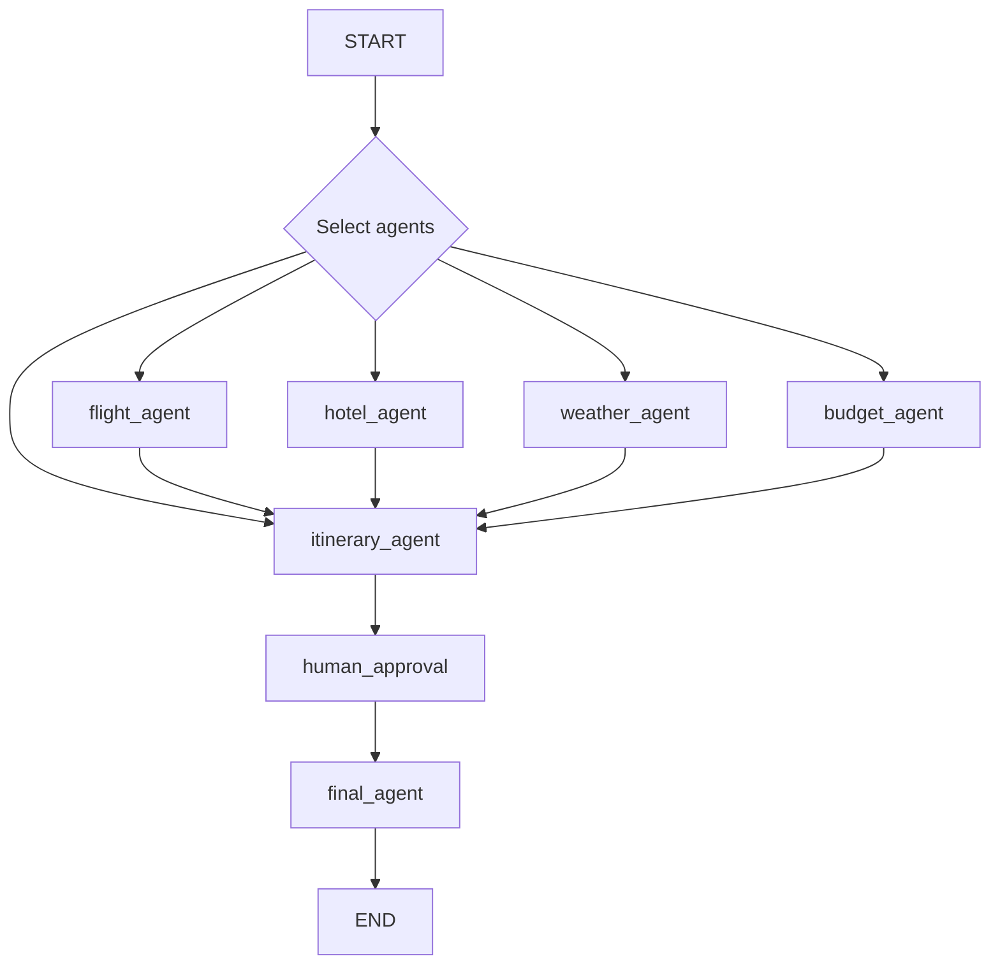

# TripMate AI — Travel Planning Multi-Agent System

TripMate AI is a travel planning application built around a multi-agent
workflow orchestrated with **LangGraph**. Instead of a single model trying
to do everything, a trip request is broken down and routed to specialist
agents — flights, hotels, weather, budget, and itinerary — which run only
when relevant, then hand off to a human-in-the-loop approval step before a
final itinerary is produced.


## How it works

Given a trip request (origin, destination, dates, travelers, budget,
interests), the graph selectively routes through only the agents relevant
to that request:



Agents run in a fixed order (flight → hotel → weather → budget), but any
agent not selected for the request is skipped — the graph routes straight
to the next selected agent, or to `itinerary_agent` once all selected
agents have run. `itinerary_agent` compiles everything into a draft, which
a human reviews and approves (`human_approval`) before `final_agent`
produces the finished plan.

### Agents

| Agent | Responsibility |
|---|---|
| `flight_agent` | Resolves origin/destination to airports and looks up live flight data |
| `hotel_agent` | Searches for accommodation options matching the trip's destination and budget |
| `weather_agent` | Pulls current conditions / forecast for the destination and travel dates |
| `budget_agent` | Estimates and checks costs against the traveler's stated budget |
| `itinerary_agent` | Combines the outputs above into a structured draft itinerary |
| `human_approval` | Pauses the graph for a human to review/edit the draft before finalizing |
| `final_agent` | Produces the final, approved itinerary |

## Tech stack

**Backend**
- FastAPI — HTTP API layer
- LangGraph — multi-agent orchestration and state graph
- PostgreSQL — checkpointing / persisted graph state (via LangGraph checkpointer)
- MCP (Model Context Protocol) — tool integration layer for external data sources
- LLM — configured via an OpenAI-compatible endpoint (works with providers like Groq, or a local Ollama server)

**External data sources (via MCP servers)**
- **AviationStack** — live flight status/schedule lookups (`flights` endpoint)
- **OpenWeather** — current conditions and forecasts
- **Tavily** — web search, used for hotel discovery

**Frontend**
- Plain HTML/CSS/JS (`/ui/`) — a structured trip-request form (origin/destination, dates, duration, travelers, budget + currency, interest chips, notes) that talks to the backend API

## API

| Endpoint | Purpose |
|---|---|
| `POST /api/travel` | Submit a new trip request and run it through the agent graph up to the human-approval checkpoint |
| `POST /api/travel/approve` | Approve (or resume) a pending draft itinerary so `final_agent` can complete it |

## Project structure

```
.
├── graph_nodes/              # Agent implementations (flight, hotel, weather, budget, itinerary, human_approval, final)
├── MCP_Severs/                # Custom MCP servers (AviationStack, OpenWeather) + MCP client wiring
├── Travel_State.py            # Shared graph state, agent ordering, agent-selection logic
├── config/                    # Settings (pydantic-settings, reads from .env)
├── ui/                        # Frontend (index.html, style.css, script.js)
├── graph.py                   # Graph construction and compilation (this file)
└── main.py                    # FastAPI app entrypoint
```

> Note: adjust the tree above if your actual file/folder names differ.

## Setup

### Prerequisites
- Python 3.11+
- PostgreSQL (for graph state checkpointing)
- API keys: [AviationStack](https://aviationstack.com/), [OpenWeather](https://openweathermap.org/api), [Tavily](https://tavily.com/)
- An OpenAI-compatible LLM endpoint (e.g. Groq, or a local [Ollama](https://ollama.com/) server)

### Installation

```bash
git clone https://github.com/Shrouk-Adel/Travel-Planning-Multi-Agent-System.git
cd Travel-Planning-Multi-Agent-System

conda create -n travel_agents python=3.11
conda activate travel_agents

pip install -r requirements.txt
```

### Configuration

Create a `.env` file in the project root:


> AviationStack's free tier only exposes the `flights` endpoint (live/
> scheduled status) — `airports` and `routes` lookups require a paid plan.
> Airport resolution in this project is handled locally instead of via
> the API.

### Running
1. run database from docker image from terminal
```bash
 docker compose up
```
2. In anohter terminal run app
```bash
python main.py
```

Then open the frontend (served from ` http://localhost:8000/`) in your browser, or send a
request directly:

```bash
curl -X POST http://localhost:8000/api/travel \
  -H "Content-Type: application/json" \
  -d '{
        "origin": "Cairo",
        "destination": "Tokyo",
        "start_date": "2026-11-01",
        "duration_days": 7,
        "travelers": 2,
        "budget": 3000,
        "currency": "USD",
        "interests": ["food", "culture"]
      }'
```

## Human-in-the-loop approval

After `itinerary_agent` produces a draft, the graph pauses at
`human_approval` rather than finalizing automatically. This lets a human
reviewer adjust or confirm the plan before `final_agent` runs — call
`POST /api/travel/approve` with the relevant thread/session identifier to
resume the graph and produce the finished itinerary.

## Known limitations

- **AviationStack free tier**: capped at 100 requests/month, and only the
  `flights` endpoint is available — no built-in route/airport database
  lookup via the API (handled locally instead).
- **Route coverage**: flight data reflects real, currently operating
  routes only — obscure city pairs with no direct service will correctly
  return no results rather than a booking option.
